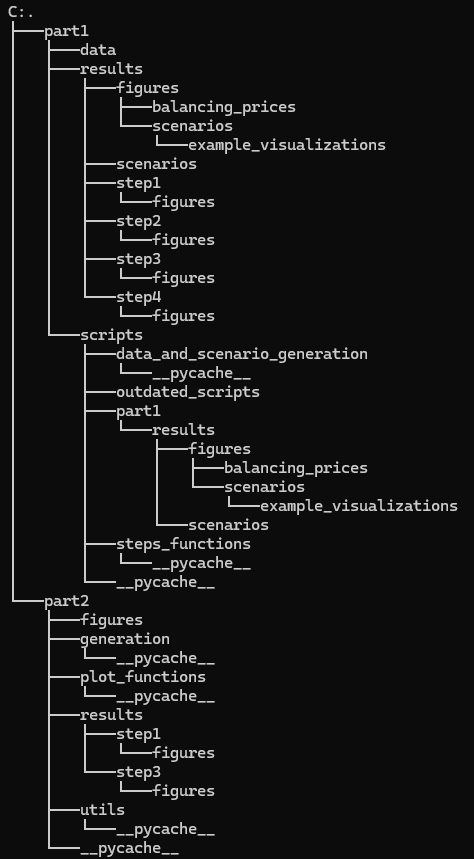

# 46755_2_ass
Assignment 2 46755 repo

Group: [7]
## Overview

This project solves the tasks outlined in assignment 46755 of the course Renewables in Electricity Markets at DTU. The course was followed during the spring of 2025.


## Quick-start Guide
Follow these steps to run the code that solves the exercises. Each step produces text output to the terminal and figures are saved to the results folder.

### Step 0: Install git to your PC
Follow the steps provided by git at:

https://git-scm.com/book/en/v2/Getting-Started-Installing-Git


### Step 1: Clone the repository with git bash

In git bash type:

git clone https://github.com/theodorbg/46755_2_ass.git

cd 46755_2_ass

### Step 2: Navigate to the root of the cloned repository with Anaconda Prompt
You can also do this using a terminal like Anaconda Prompt.
Example path on Windows:

cd C:\Users\User_example\folder_example\46755_2_ass

### Step 3: Install the package
Run the following command:

pip install .

This will automatically install the required dependencies listed in setup.py, including:

numpy, pandas, matplotlib, scipy, pytest, os, pickle, gurobipy, sys,pathlib, random

### Step 4: Run the main scripts

For part 1, each step can be run individually like so:

python .\part1\scripts\main_step1.py
python .\part1\scripts\main_step2.py
python .\part1\scripts\main_step3.py
python .\part1\scripts\main_step4.py

As some of the steps depend on each other, they also run each other, so the terminal will also display results from the previous steps when you run step 2, for example.

For part 2, each step can be run individually like so:

python .\part2\step1.py
python .\part2\step2.py
python .\part2\step3.py

## Architecture
This section describes the folder structure, the class `ConsumptionProfile` and its key functions, as well as the overall workflow of the package.

The folder structure of the package 




## Package Structure and Classes

### Main Script

### ConsumptionProfile
This class generates the electricity consumption profiles with constrained properties to be analyzed in part 2. In hindsight, a class should also have been used to generate the scenarios of part 1.
The consumption profile is generated as a time series with random variations,
but with constraints on minimum/maximum values and maximum rate of change.
This simulates realistic electricity consumption behavior.


#### `def __init__(self, lower_bound: float, upper_bound: float)`
Initializes an instance of a consumption profile
     
#### `def generate_profile(self, seed = None)`
Generate a random consumption profile within defined constraints.
The profile starts with a random value within bounds, then each subsequent
point varies by a random amount limited by max_change. All values are
kept within the lower and upper bounds.
     
#### `def verify_profiles(in_sample_profiles, out_sample_profiles)`
Verify that the generated profiles meet all required constraints.
    
    This function checks:
    1. The number of profiles in each set
    2. The length of each profile
    3. Whether all values are within specified bounds
    4. Whether all changes between consecutive points are within max_change
    


## Code Description

### Package Architecture Description
The assignment is seperated into two folders, part1 and part2. Within each folder, the results for each step can be viewed in the results folder. The structure of part1 and part2 differ slightly, but it should be quite intuitive nevertheless. 

For part1, the main scripts are located in the scripts folder, while helping functions are in the folder "steps_functions". The folder "data_and_scenario_generation" contain the code that generates the scenarios to be analyzed. 

For part 2, the main scripts are located in the head of the part2 folder, while helping functions are located in "utils". The class "ConsumptionProfile" is located in the folder "generation". 

The main scripts are mainly executing the helping functions, that actually solve the steps. Therefore the main scripts should be quite straight forward to read and understand. To get a detailed idea of how the assingnment is solved, you  need to read into the helping functions. 


#### Part 1: Scenario Generation

**Technical Documentation: Scenario Generation Process for Wind Production and Market Price Modeling**

---

### Data Foundation and Scenario Construction

The scenario generation module constructs a set of electricity market and wind production scenarios by combining three foundational data sources:

- **Wind Production Data (`df_wind`)**: A 24×N matrix representing hourly wind generation values across N days.
- **Day-Ahead Price Data (`df_price`)**: A 24×N matrix containing hourly electricity market prices.
- **System Condition Data (`df_conditions`)**: A 24×4 matrix defining system states (0 = excess, 1 = deficit) across four distinct condition patterns.

---

### Balancing Price Derivation

For each of the four system condition patterns, the algorithm generates corresponding balancing price matrices using the following transformations:

> These condition-specific price matrices (`balancing_prices_list`) capture the price asymmetry in imbalance markets, where penalties for shortfalls exceed rewards for surpluses.

---

### Combinatorial Scenario Generation

The full scenario space is constructed using a combinatorial approach:

```

For each condition pattern (0 to 3):
For each wind generation day (0 to wind\_days - 1):
For each price day (0 to price\_days - 1):
Create a complete 24-hour scenario

````

Each scenario is represented as a `DataFrame` with the following structure:

- Hourly index (0–23)
- Condition indicators (0/1 for each hour)
- Day-ahead prices
- Balancing prices (derived from condition and day-ahead prices)
- Wind production values

Each scenario also includes metadata in the DataFrame attributes:

- `condition_id`
- `wind_day`
- `price_day`

---

### Stochastic Sampling with Reproducibility

A deterministic random sampling process selects a subset of scenarios for modeling:

```python
rng = np.random.RandomState(42)  # Fixed seed for reproducible sampling
all_indices = rng.choice(list(sample_scenarios.keys()), 
                         size=total_scenarios_to_select,
                         replace=False)  # Sampling without replacement
````

* The first 200 selected scenarios are assigned as **in-sample** (`keys 0–199`)
* The remaining are **out-of-sample** (`keys 200–1599`)

This ensures:

* A reproducible training/testing split
* No duplication between sets
* Sufficient diversity across samples

---

### Persistence and Analysis

Scenarios are saved as `.pkl` (pickle) files to preserve the full structure, including metadata. Visualization tools are included to support:

* Time-series inspection of individual scenarios
* Comparative analysis of balancing prices across system conditions

---

This scenario generation process provides stochastic optimization models with a rich, diverse, and structurally consistent set of future system states. It captures the complex interdependencies between wind production, electricity prices, and grid conditions.

#### Part 2 Scenario Generation
Here’s a clean, Markdown-formatted version for your `README.md`:

---

### Electricity Consumption Profile Generation

Electricity consumption profiles are generated using a constrained random walk algorithm implemented in the `ConsumptionProfile` class. Each profile consists of 60 data points, representing minute-by-minute power consumption over a one-hour period. The generation process follows strict mathematical and physical constraints:

#### Initialization

Each profile begins with an initial value $P_0$ randomly selected from a uniform distribution between 220 kW and 600 kW:

```
P₀ ~ U(220, 600)
```

#### Sequential Generation

For each subsequent time step $t ∈ \{1, 2, ..., 59\}$, the next value is derived by applying a random perturbation $ΔP_t$ to the previous value:

```
Pₜ = Pₜ₋₁ + ΔPₜ
```

#### Rate-of-Change Constraint

The perturbation $ΔP_t$ is sampled from a uniform distribution limited to a maximum change of ±35 kW:

```
ΔPₜ ~ U(-35, 35)
```

#### Boundary Enforcement

After applying the perturbation, the value is clamped to ensure it stays within physical limits:

```
Pₜ = max(220, min(Pₜ, 600))
```

#### Deterministic Reproducibility

If a seed is provided, the random number generator is initialized with it to ensure reproducible results.

---

